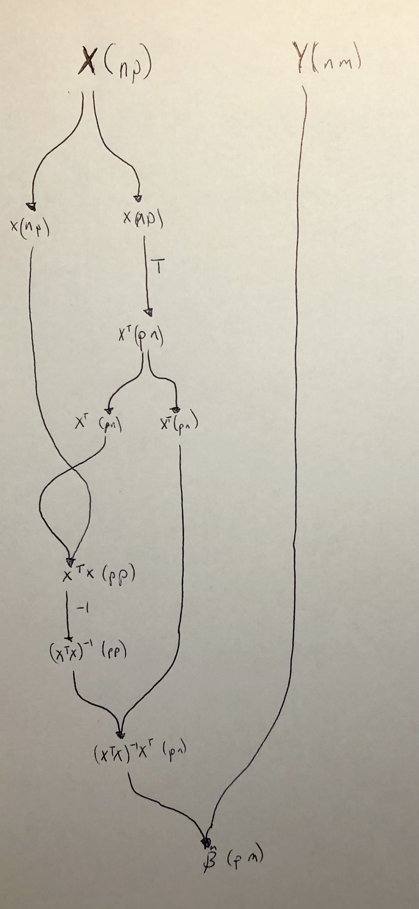

A couple of years ago, 
I read 
[Conal Elliot's](http://conal.net/)
[Compiling to Categories](http://conal.net/papers/compiling-to-categories/) paper.
I thought at the time "Wow, this is amazing",
but I didn't have the key that made the ideas concrete for me.
[Chris Penner's](https://chrispenner.ca/)
talk on 
[deconstructing lambdas](https://www.youtube.com/watch?v=xZmPuz9m2t0)
unlocked Conal's paper for me.
In today's post,
I'm making sure I understand the basics by implementing the 
[ordinary least squares estimator](https://en.wikipedia.org/wiki/Ordinary_least_squares)
using categories.

The key idea of "Compiling to Categories" is right there in the first sentence:

> As discovered by [Joachim Lambek](https://en.wikipedia.org/wiki/Joachim_Lambek), 
> the models of the simply typed λ-calculus (STLC)
> are exactly the cartesian closed categories (CCC).

In other words, programming in a cartesian closed category _is_
programming in a simply typed λ-calculus.
Or more specifically,
the STLC/CCC relationship means
one can program using categories and compile to any language
that supports a STLC.
If you're not familiar with either the λ-calculus or category theory,
that's fine.
My goal here is not to go in depth into the concepts,
instead I hope my example is a teaser for statisticians
to engage with category theory.

For this post I'm going write a single program for the following, 
a formula statisticians will be familiar with:

\(
\hat{\beta} = (X^{\intercal}X)^{-1}X^{\intercal}Y.
\)

Then I will compile this program into multiple target languages, namely 
[Haskell](https://www.haskell.org/) 
and 
[R](https://www.r-project.org/).
The full script for this post is in [`Example.hs`](Example.hs),
and I've included snippets below.

## Categorical Building Blocks

A category in mathematics is comprised of 
a set of objects,
a set of arrow (morphisms) between objects,
and way of composing arrows together subject to certain laws
([more details for the uninitiated here](https://en.wikipedia.org/wiki/Category_theory#Categories,_objects,_and_morphisms)).
In Haskell, a category can be represented by a typeclass `Category`
where the category is parameterized the type of its arrows.

```haskell
class Category k where
  -- The identity morphism takes an object A and returns A
  id :: a `k` a
  -- The composition rule says that for any two morphisms A --> B and B --> C,
  -- there exists a morphism A --> C. 
  -- This is encoded by a Haskell function that transforms the morphisms.
  (>>>) :: a `k` b -> b `k` c -> a `k` c
```

Similar to equipping sets with additional structure,
categories can have additional structure too.
In particular, a *Cartesian* category comes equipped with products:
a way to stick two things together into a pair and get them back out.

```haskell
class Category k => Cartesian k where
  exl :: (l, r) `k` l
  exr :: (l, r) `k` r
  (△) :: a `k` c -> a `k` d -> a `k` (c, d)
```

The added structure that products impart is quite useful. 
For example, we now have a way to copy data.

```haskell
copy :: (Cartesian k) =>  a `k` (a, a)
copy = id △ id
```

The cartesian structure also provides
a way to swap the order of elements in a pair.

```haskell
swap :: (Cartesian k) => (a, b) `k` (b, a)
swap = exr △ exl
```

We now have almost all the tools we need in terms of category theory.
The [`Strong` class](https://hackage.haskell.org/package/profunctors-5.6.2/docs/Data-Profunctor.html#t:Strong)
provides a way of embedding morphisms within a higher-order structure
(I'm not sure where the term "strong" comes from).
Conal's paper doesn't use `Strong` (at least that I can tell),
but the utilities available once we have it are useful.

```haskell
class Category k => Strong k where
  first :: a `k` b -> (a, other) `k` (b, other)
  second :: a `k` b -> (other, a) `k` (other, b)
```

Those utilities are 
`***` 
(which similar to [`Data.Bifunctor.bimap`](https://hackage.haskell.org/package/base-4.17.0.0/docs/Data-Bifunctor.html#v:bimap)) 
and 
`&&&`:

```haskell
(***) :: (Category k, Strong k)
      => l `k` l'
      -> r `k` r'
      -> (l, r) `k` (l', r')
(***) l r = first l >>> second r

(&&&) :: (Cartesian k, Strong k)
      => a `k` l
      -> a `k` r
      -> a `k` (l, r)
(&&&) l r = copy >>> (l *** r )
```

## Matrix Primitives

Since [vector spaces form a category](https://ncatlab.org/nlab/show/Vect),
in principle one could encode the following matrix operations
in a categorical way (as linear maps).
But for since I'll be compiling to R and matrices are quite natural in R,
I'm going to assume that whatever language I compile to
has the following primitive matrix operations:

```haskell
class MatrixPrimitives k where
  transpose :: (LA.Transposable m mt) => m `k` mt
  invert :: (KnownNat n, Domain f v m) => m n n `k` m n n
  compose :: (KnownNat n, KnownNat p, KnownNat m) => (L m p, L p n) `k` L m n
```

## Compilation of Categories

### Haskell 

Functions and types in Haskell form a category, 
so defining morphisms is quite straightforward.
For example, `>>>` is function composition 
(`flip`ped from the Haskell default).
Here `P` is `Prelude` and `B` is `Data.Bifunctor`.

```haskell
instance Category (->) where
  id = P.id
  (>>>) = P.flip (P..)

instance Cartesian (->) where
  exl = P.fst
  exr = P.snd
  (△) f g x =  (f x, g x)

instance Strong (->) where
  first = B.first
  second = B.second
```

For matrix primitives, I use the 
[`hmatrix` package](https://hackage.haskell.org/package/hmatrix).

```haskell
instance MatrixPrimitives (->) where
  compose = P.uncurry (<>)
  transpose = tr
  invert = inv
```

### R


I first define a type `R` which will contain `R` expressions as `Text`.
This type has two parameters, as `Category` needs to two parameters.
But these types are simply bookkeeping when we're writing Haskell;
information in these types is not passed to `R`.

```haskell
newtype R a b = MkR T.Text deriving (P.Eq)
```

Now I define a way to print the `R` expressions and write it to a file.

```haskell
instance P.Show (R a b) where
  show (MkR x) = P.show x

genRcode :: R a b -> P.IO ()
genRcode (MkR x )= T.writeFile "test.R" ("catf <-" P.<> x P.<> "\n")
```

Defining `Category` for `R` is where things start to get interesting,
but again it's straightforward.
The `id` function uses `R`'s lambda syntax to take `x` and return `x`, unchanged.
The (`>>>`) operation pattern matches
on the constructor `MkR` expressions `f` and `g`
and returns an expression for an `R` function
that applies `f` and then `g` to its input. 
Note: the `[i||]` syntax is a 
[`string-interpolation` quasiquoter](https://hackage.haskell.org/package/string-interpolate).


```haskell
instance Category R where
  id = MkR "\\(x) x"
  (>>>) (MkR f) (MkR g) = MkR [i|
  function(x) {
    f <- #{f}
    g <- #{g}
    g(f(x)) 
  }|]
```

The instances for `Cartesion` and `Strong` are similar.
I use `list` to represent a pair in `R`.

```haskell
instance Cartesian R where
  exl = MkR "\\(x) x[[1]]"
  exr = MkR "\\(x) x[[2]]"
  (△) (MkR f) (MkR g)  = MkR [i|
  function(x) {
    f <- #{f}
    g <- #{g}
    list(f(x), g(x))
  }|]


instance Strong R where
  first (MkR f) = MkR [i|
    function(x) {
      f <- #{f}
      x[[1]] <- f(x[[1]])
      x
    }
    |]
  second (MkR g) = MkR [i|
    function(x) {
      g <- #{g}
      x[[2]] <- g(x[[2]])
      x
    }
    |]
```

The `R` `MatrixPrimitives` are the usual `t`, `solve`, and `%*%` functions.

```haskell
instance MatrixPrimitives R where
  transpose = MkR "function(x) { t(x) }"
  invert = MkR "function(x) { solve(x) }"
  compose = MkR "function(x) { x[[1]] %*% x[[2]] }"
```

## Linear Regression Mapping

We want to express the following in a categorical way:

\(
\hat{\beta} = (X^{\intercal}X)^{-1}X^{\intercal}Y.
\)

Here's a way to do that:

```haskell
lmFit :: (Cartesian k, Strong k, MatrixPrimitives k
        , KnownNat p, KnownNat n, KnownNat m) =>
    (L n p, L n m) `k` L p m
lmFit = 
  first (copy
        >>> second ( transpose >>> copy)
        >>> ((exr >>> exl) △ exl) △ (exr >>> exl)
        >>> first (compose >>> invert)
        >>> compose)
  >>> compose
```

This could surely be simplified,
but the key (for me) in writing the code above 
was to first write $\hat{\beta}$ as a 
[string diagram](https://ncatlab.org/nlab/show/string+diagram#InLinearAlgebra)
(see image below).
The `lmFit` code is following along the diagram top to bottom.
I've included the matrix dimensions in the diagram
to make it easier to see what's happening.



## Does it work?

Let's first try a simple example in Haskell
by taking the average for 4 numbers.
When the design matrix is a vector of ones,
$\hat{\beta}$ should simplify to the arithmetic mean.
Let's check:

```haskell
x = matrix 
    [ 1
    , 1
    , 1
    , 1] :: L 4 1

y = matrix
    [ 2
    , 1
    , 0
    , 2] :: L 4 1

test = lmFit (x, y)
```

Evaluating `test` in a `ghci` session results in:

```sh 
ghci> test
(1.25 :: L 1 1)
```

Looks good. Let's try it in `R`.
First we create the `lmFit` value for the `R` type.
We have to put something for the matrix dimensions.
What they are don't matter; 
they just need to conform.

```haskell 
r :: (L 4 1, L 4 1) `R` L 1 1
r = lmFit
```

You can view the result in the [`test.R` script](test.R).
Testing it out with the same numbers as above:

```R 
> catf(list(c(1, 1, 1, 1), c(2, 1, 0, 2)))
     [,1]
[1,] 1.25
```

Neat.
I'll end by comparing to the built-in `lm` with multiple regressors:

```R 
> X <- matrix(rnorm(100), ncol = 2)
> Y <- rnorm(50)
> catf(list(X, Y))
            [,1]
[1,]  0.04724210
[2,] -0.01312188
> lm(Y ~ -1 + X)

Call:
lm(formula = Y ~ -1 + X)

Coefficients:
      X1        X2  
 0.04724  -0.01312  
```

## Notes

* In principle,
I could have started with the least squares objective function
and 
[automatically derived the solution (i.e. $\hat{\beta}$)](http://conal.net/papers/essence-of-ad/)
using category theory.
* I targeted Haskell and R in my example, 
but one could compile to Python, Javascript, graphs, and much more.
